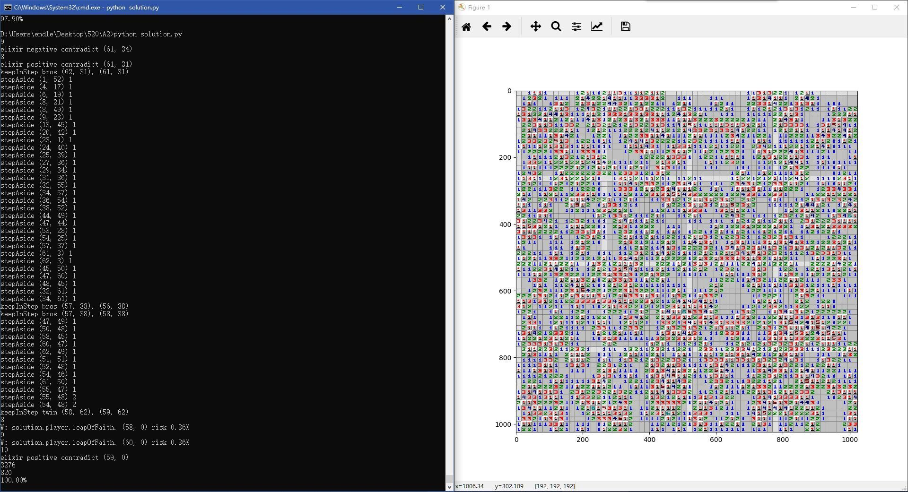
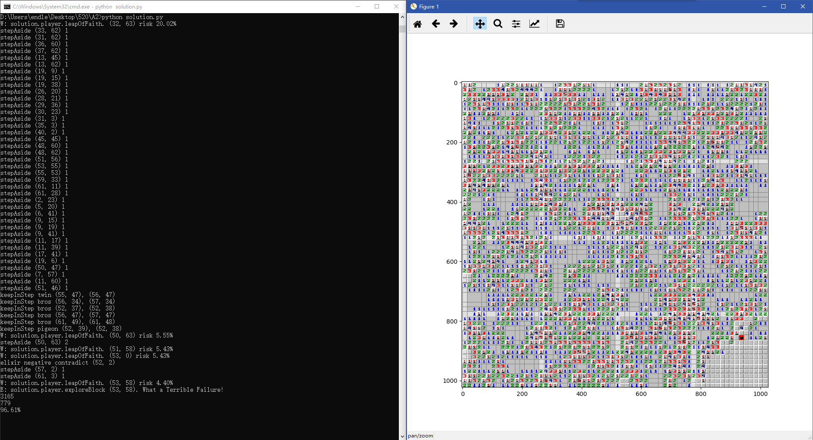

# Solution Algorithm Explanation
There are mainly 4 algorithms (`stepBystep`, `stepAside`, `keepInStep`, and `elixir`) to solve minesweeper, 1 algorithm (`leapOfFaith`) to get out of dead ends, and 1 function (`firstStep`) to find a good start.

## `stepBystep`
This algorithm uses the notion of influence chain, and it is based on probability.

### Key Point
For each inconclusive block, say Block A, it can have at most 9 probability of being a mine block. 8 of them are conditional probability $P(A = mine| NeighborClue = x)$, and 1 left is a basic probability $P(A = mine)$ that is given by the whole board information.

For example, given a board like Fig.1. The probability of A being a mine block can be calculated as below:


Fig. 1: a 5 by 5 board with 10 mines.

$P_1(A=mine|Neighbor1Clue = 1) = \frac{1}{8}$
$P_2(A=mine|Neighbor2Clue = unknown)$ cannot be caculated now
$P_3(A=mine|Neighbor3Clue = 3) = \frac{3}{8}$
$P_4(A=mine|Neighbor4Clue = unknown)$ cannot be caculated now
$P_5(A=mine) = \frac{10-0}{5*5-4-0} = \frac{10}{21}$
$P_6(A=mine|Neighbor6Clue = unknown)$ cannot be caculated now
$P_7(A=mine|Neighbor7Clue = 4) = \frac{4}{8}$
$P_8(A=mine|Neighbor8Clue = unknown)$ cannot be caculated now
$P_9(A=mine|Neighbor9Clue = 7) = \frac{7}{8}$

**If anyone above becomes 1, A must be a mine. And vice versa, 0 indicates that A is safe.** (Assume every clue is accurate.)

Usually, $P_5$ hardly goes to 0 or 1. Therefore, we can focus on the other 8 conditional probability. The only time those 8 probability change is the case we know more things about these 8 blocks. There are 2 different cases: **revealing a hint block** and **concluding a mine block**.

### Revealing a Hint Block
If the new hint block is a neighbor of `Block A`. For example, reveal a new 3 above `A`. (See Fig. 2.)


Fig. 2: a newly revealed `3`.

Certainly, we get $P_2(A=mine|NeighborClue = 3) = \frac{3}{6}$. Note that there are only 6 inconclusive blocks around this newly revealed block.

Futhermore, $P_1, P_3$ should be updated because the number of their inconclusive neighbor decreased by 1. $P_1 = \frac{1}{7}, P_3 = \frac{3}{7}$

Would a hint block that is not a neighbor of `Block A` but influence `Block A`? The answer is yes. Notice that $P_1$ is changed because we revealed a neighbor of `Block 1`. Though this new block is not a neighbor of `Block A`, it still can influence `Block A` if it is a neighbor of neighbors of `Block A`. Fig. 3 is an example.


Fig.3: a newly revealed block that is not a neighbor of `Block A`.

In this case, $P_1 = \frac{1}{7}, P_7 = \frac{4}{7}$.

### Concluding a Mine Block
Though a mine block will not directly provide any infomation, it can also influence `Block A` in the same way of revealing a hint block that is not a neighbor of `Block A`. Here is an example. (See Fig. 4.)


Fig. 4: a newly concluded mine block.

Notice that not only the number of inconclusive blocks, but also the number of inconclusive mines decreased by 1. Therefore, $P_1 = \frac{0}{7} = 0, P_7 = \frac{3}{7}$

In this case, $P_1$ becomes 0, which indicates `A` must be safe and we can reveal `A`. Note that actually all inconclusive neighbors of `Block 1`, including `Block A`, are safe because all of them have a conditional probability becomes 0.

### Pseudo Code
```
stepBystep():
	while not safeWaiting.empty() and not flagWaiting.empty():
		while not safeWaiting.empty():
			pos = safeWaiting.pop()
			hintSafeBlock(pos)
		while not flagWaiting.empty():
			pos = flagWaiting.pop()
			flagMineBlock(pos)
	return

hintSafeBlock(pos):
	hint = reveal(pos)
	updateNeighborP(pos)
	for nPos in neighbor(pos):
		if nPos is hintBlock:
			updateNeighborP(nPos)
	return

flagMineBlock(pos):
	flag(pos)
	for nPos in neighbor(pos):
		if nPos is hintBlock:
			updateNeighborP(nPos)
	return

updateNeighborP(pos):
	prob = pos.warn / pos.left
	for nPos in neighbor(pos):
		if nPos is inconclusiveBlock:
			update(nPos.prob, prob)
			if prob == 1:
				flagWaiting.add(nPos)
			else if prob == 0:
				hintWaiting.add(nPos)
	return
```

### Some Discussion
1. Is it necessary to update probablity every time? Because only 0 and 1 can be processed.
Yes, any probability between 0 and 1 is meaningless for stepByStep. But other algorithms, such as `stepAside`, will use these probability. Therefore it can be regard as a preprocessing of other algorithms.
2. What is its complexity?
Space complexity is $O(n^2)$ because we need store the whole board's prob value.
Time complexity is $O(1)$ in each iteration.
3. Why do we use probablities and matrices instead of any other tools as knowledge base?
There are mainly 2 reasons. the first one is that probability-based code can be easily modified to adapt the second bonus - uncertainty. The other one is something about efficency. Matrices knowledge base is sort of natrually organized by geometric position, which will safe lots of time from tring combining totally unrelated information. Compared to equation-based knowledge base, probablity can be easily caculated into each block, and it is also convinent to add them up to use as a whole information. However, equations are extreamly hard to breakdown into small pieces of information. It is also sort of lacking some scense of direction to reconstruct a large equation using small pieces.

## `stepAside`
This algorithm uses the notion of pattern recognition, and it is also based on probability. It focus on some cases like Fig. 5.


Fig. 5: a 3 by 3 board, where A+B=1 and A+B+C=2.

### Key Point
If we substitute $1$ for $A + B$, $1 + C = 2 \Rightarrow C = 1$. Done.

Hence, the point is how could we find this structure in a large board.

The reason we can substitute is that $A+B$ have a total value, and it appears in another equation. In another word, All inconclusive neighbors of `Block 2` are `Block A` and `Block B`, and both of them belong to inconclusive neighobrs of `Block 4`.

Hence, we can define this pattern as **a "override" relation**, i.e. **all inconclusive neighbors of one block are in the set of all inconclusive neighbors of another block**. $InconclusiveNeighbor(X) \subset InconclusiveNeighbor(Y)$.

Therefore we can use hash function to identify each block's inconclusive neighbors.

### Hash Function
Notice that "override" relation is actually "subset" relation. and "subset" relation is equivalent to "divisible" relation.

Therefore, we can assign each block a prime number, and $InconclusiveHash(X) = \prod\limits_{pos \in inconclusive} prime(pos)$. $InconclusiveHash(Y)$ mod $InconclusiveHash(X) = 0 \Rightarrow InconclusiveNeighbor(X) \subset InconclusiveNeighbor(Y)$.

However, for a large board, say 64 by 64, we will use 4096 prime numbers. The largest one is about $40000$, which is unacceptable because the worst case we have to multiply 8 prime numbers, and it will be larger than $10^{36}$.

Notice that not all block pairs can be "overridable", because they must share at least 1 common neighbor. Only 2 blocks in a 3 by 3 square can be "overridable". Therefore, the minimum requirement is to guarantee these 9 blocks to have a unique hash value, Note that neighbors are 8 surrounding blocks. We just need 25 prime number, and use it repetively. (See Fig. 6.)


### Solve Override Relation
Instead of substituting equation $A + B = 1$, we choose to substitue probablity $P(A) = 0.5, P(B) = 0.5$.

Consider $E(A+B+C) = 2 = P(A) + P(B) + P(C)$:
$P(C) = 1$, and add `Block C` into Flag Waiting Line.

In general, there are mainly 3 steps:
1. Subsitute parent block's probability for child block's probablity, and fix them.
2. Redistrube parent block's probability according to the expection.
3. If new probabilities become 1 or 0, add those blocks into waiting line.

### Pseudo Code
```
StepAside():
	solveFlag = False
	if checkOverride():
		sort(override, 'cNum')
		cNumLim = 25
		for pPos, cPosList, cNum in override:
			if cNum > cNumLim:
				break
			for cNumTempLim in range(cNumTemp, 0, -1):
				tempSolveFlag = solveOverride(pPos, cPosList, cNumTempLim)
				if tempSolveFlag:
					solveFlag = True
					cNumLim = cNum
					break
	return solveFlag

checkOverride():
	override = []
	for each block pPos:
		if pPos is done block:
			continue
		cPosList = []
		for each 5 by 5 surrounding block cPos:
			if cPos is done block:
				continue
			if inconclusvieHash(pPos) % inconclusiveHash(cPos) == 0:
				cPosList.append(cPos)
		if cPosList:
			override.add((pPos, cPosList, len(cPosList)))
	return override

solveOverride(pPos, cPosList, cNumTempLim):
	for cPosTempList in combinations(cPosList, cNumTempLim):
		tempBoard = 3 by 3 empty board
		conflict = fillCProb(tempBoard, cPosTempList)
		if conflict:
			continue
		solveFlag = redistributePProb(pPos, tempBoard)
		if solveFlag:
			return True
	return False

fillCProb(tempBoard, cPosTempList):
	for cPos in cPosTempList:
		copy inconclusiveNeighbor(cPos).prob to tempBoard
		if conflict:
			return False
	return True

redistributePProb(pPos, tempBoard):
	sumProb = 0
	pUniqueNebr = []
	for nPos in inconclusiveNeighbor(pPos):
		if nPos is fixed by cPos:
			sumProb = sumProb + tempBoard.nPos.prob
		else:
			pUniqueNebr.append(nPos)
	tempProb = (pPos.warn - sumProb) / len(pUniqueNebr)
	if tempProb <= 0:
		hintWaiting.update(pUniqueNebr)
		return True
	else if tempProb >= 1:
		flagWaiting.update(pUniqueNebr)
		return True
	return False
```

### Some Discussion
1. Why do we prefer using probabilities rather than using equations?
Except it is more efficent, it can also solve some special cases much easier. Here is an example. (See Fig. 7.)

Fig. 7: a 5 by 5 board with an override relation
There are 3 equations, "A+B+C=2", "C+E+H=2" and "A+B+C+D+E+F+G+H = 3". However, it is hard to dicide how to combine them. 
Yet, we can solve it without any thinking by filling probablities. Set `A`, `B`, `C`, `E`, `H` are 0.67, and redistribute probablities on `A`, `B`, `C`, `D`, `E`, `F`, `G`, `H`. Therefore, `D`, `F`, `G` becomes -0.11. Namely, `D`, `F`, `G` must be safe. Actually, since their probablities becomes negative, there must be at least 1 mine shared by 2 children.
2. Why do we sort override?
Because a large `cNum` usually leads to confliction. It takes too much time to deal with confliction. Therefore we prefer solving those relations with small `cNum`, and hope we can break down those complex relations by solving simple relations and getting more hints. Therefore, if we solve a relation with `cNum == 2`, we will put those relations with `cNum > 2` aside and shift gears to `setpByStep` to get more hints.
3. What is confliction?
2 child blocks provide different probabilities to one block. (See Fig. 8.) In this case, we cannot directly solve it.

Fig. 8: an override relation with confliction.
In this case, `C` has 2 different probablities: $P_1 = 0.67, P_9 = 0.33$. If we ignore one probablity, say $P_1$, we should also ignore all the probablities provided by `Block 4`.
4. How to deal with confliction?
Try to use a subset of cPosList to avoid confliction. In some cases, we can construct a new override relation that can be solved. For example, Fig. 9 is solvable. 

Fig. 9 an override relation with confliction but can be solved.
Notice we can construct a new override relation with only `Block 2` and `Block 4`. Now there is no confliction in the new relation, and it is solvable.
Yet there are still some cases that we cannot solve. Fig. 8 is a good example. Notice that those cases are not solvable even if we use equations. Therefore, not all the override relations are solvable, but many of them can be solved.
5. Will this algorithm together with `stepByStep` solve minesweeper completely?
No. There are some cases it cannot solve. Fig. 10 is an example.

Fig. 10: a 5 by 5 board without any override relations.
Notice that "A+B+C=2", "B+C+D=2", "C+D+E=1". In this case, `E` must be a safe block, and `B` must be a mine block. However, there is no override relations. We do need some other algorithms to solve this case.
6. What is its complexity?
Space complexity: $O(n^2)$, becasue we need store all override groups in oreder to sort them.
Time complexity: $O(n^2)$. Though we have to sort all the groups in terms of `cNum`, the size of list is at least polynomially smaller than $n^2$. Therefore, searching part is dominant.
7. Can it be improved more?
Yes. There are many different ways. 
**A. Keep** `tempBoard`**, and use it when** `updateNeighborP`**,** `stepAside` **other blocks, and** `leapOfFaith`**.**
Since we have a more persice probablity distribution of neighbors of `pPos`, we can keep it when making other decision. For example, construct cascade override relations. (See Fig. 11.)

Fig. 11: a 7 by 7 board with a cascade override relation.
Notice `Block 3` and `Block 5` is an override pair, but it is not solveable. Also, `Block 5` and `Block 4` are not in a simple override relation. Yet those 3 blocks are in a cascade override relation because unique neighbors of `Block 5`, `D`, `E`, `F`, are neighobrs of `Block 4`. In this case, probablities of `D`, `E` and `F` are 0.67, leading to the fact that `G`, `H`, `I` become 0.
However, it will result in a larger search range, which is time-consuming. Also, if we want to use it in `leapOfFaith`, we must update this `tempBoard` evertime there is a change. It is also not worthy because usually `leapOfFaith` will be used less than 5 times in a 64 by 64 board with 820 mines. But updating `tempBoard` could be frequent.
**B. Dealing with abnormal probablities which are greater than 1 or less than 0.**
As Fig. 7 shows, if probablities go negative, there must be a shared mine block of 2 children blocks. Also, if probablities become greather than 1, there must be a shared safe block. If there is only 1 shared block, it must be that block. Here is the psudo code:
```
solveOverride(pPos, cPosList, cNumTempLim):
	for cPosTempList in combinations(cPosList, cNumTempLim):
		tempBoard = 3 by 3 empty board
		conflict, shared = fillCProb(tempBoard, cPosTempList)
		if conflict:
			continue
		solveFlag = redistributePProb(pPos, tempBoard, shared)
		if solveFlag:
			return True
	return False
	
fillCProb(tempBoard, cPosTempList):
	shared = {}
	for cPos in cPosTempList:
		copy inconclusiveNeighbor(cPos).prob to tempBoard
		if conflict:
			return False, {}
		if share:
			shared.add(cPos)
	return True, shared

redistributePProb(pPos, tempBoard, shared):
	sumProb = 0
	pUniqueNebr = []
	for nPos in inconclusiveNeighbor(pPos):
		if nPos is fixed by cPos:
			sumProb = sumProb + tempBoard.nPos.prob
		else:
			pUniqueNebr.append(nPos)
	tempProb = (pPos.warn - sumProb) / len(pUniqueNebr)
	if tempProb <= 0:
		hintWaiting.update(pUniqueNebr)
		if tempProb < 0 and len(shared) == 1:
			flagWaiting.update(shared)
		return True
	else if tempProb >= 1:
		flagWaiting.update(pUniqueNebr)
		if tempProb > 1 and len(shared) == 1:
			hintWaiting.update(shared)
		return True
	return False
```
8. Have we implemented the idea of dealing with abnormal probabilities?
Actually, we have not for 2 reasons. 
**A. It is too late to come up with this idea.**
I come up with it when writing this document on Sunday. Unfortunately we do not have enough time to implement and test it.
**B. This case is not common, and at least it can be solved by** `elixir`**.**
In previous tests, most (about 80%) override relations solved are relations with `cNum == 1`, which cannot lead to abnormal probabilities. Also, `elixir` can solve those cases, therefore it will not dramatically influence the preformance in terms of compelete rate.

##  `keepInStep`
This algorithm uses the notion of pattern recognition, and it is sort of based on equations. It focus on some cases like Fig. 10.

### Key Point
Notice that we can solve Fig. 10 because there are 2 common neighbor shared by 2 `Block 2`. In general, it is the case in Fig. 12.


Fig. 12: 2 hint block `X` and `Y` share 4 common neighbors, `M`, `N`, `O` and `P`. Each of them has 3 unique neighobrs.

Note that there are "A+B+C+M+N+O+P=X" and "D+E+F+M+N+O+P=Y". Consequently, there is "A+B+C-D-E-F=X-Y".

There are 2 special cases and another usually solvable case.
1. **"Twin" relation:**
In this case, "X=Y". Therefore, `A`, `B`, `C` and `D`, `E`, `F` are "symmetric". Namely, if there is a safe block in one side, there must be a safe block in the other side and vice versa. 
Hence, we can compare `A`, `B`, `C` to `D`, `E`, `F` to find some more information.
2. **"Pigeon Twin" relation:**
In this case, "X=Y+3". Therefore, `A`, `B` and `C` must be mine blocks and `D`, `E`, `F` must be safe blocks.
3. **"Brother" relation:**
In this case, "X=Y+1" or "X=Y+2". We can still compare `A`, `B`, `C` to `D`, `E`, `F` but with some biases.

Note that **there are some more general cases** such as Fig. 13 and Fig. 14.


Fig. 13: `X` and `Y` share 3 common neighbors and each of them has 5 unique neighbors.


Fig. 14: `X` and `Y` share 2 common neighbors and each of them has 5 unique neighobrs.

As `X` and `Y` get farther and farther from each other, it is less an less probable to be solved because they have more and more unique neighobrs. Therefore we will focus on cases of Fig. 12, Fig. 13 and Fig. 14.

### Pseudo Code
```
keepInStep():
	solveFlag = False
	twin, bros, pigeon = checkTwin():
	while twin:
		for oPos, yPos in twin:
			tempSolveFlag = solveBros(oPos, yPos)
			if tempSolveFlag:
				solveFlag = True
	while bros:
		for oPos, yPos in bros:
			tempSolveFlag = solveBros(oPos, yPos)
			if tempSolveFlag:
				solveFlag = True
	while pigeon:
		for oPos, yPos in bros:
			tempSolveFlag = solveBros(oPos, yPos)
			if tempSolveFlag:
				solveFlag = True
	return SolveFlag

checkTwin():
	twin = {}
	bros = {}
	pigeon = {}
	for each block bPos:
		if oPos is done block:
			continue
		for each manhattanDist <= 2 surrounding block yPos:
			if yPos is done block:
				continue
			if oPos.hint == yPos.hint:
				twin.add((oPos, yPos))
			else if oPos.hint == yPos.hint + 5:
				pigeon.add((oPos, yPos))
			else if oPos.hint == yPos.hint + 3 and manhattan(oPos, yPos) == 1:
				pigeon.add((oPos, yPos))
			else:
				bros.add((oPos, yPos))
	return twin, bros, pigeon

solveBros(oPos, yPos):
	oUniqNebr = {neighbor(oPos)} - {neighbor(ypos)}
	yUniqNebr = {neighbor(yPos)} - {neighbor(opos)}
	oSafe, oFlag, oInconclusivePos = count(oUniqNebr)
	ySafe, yFlag, yInconclusivePos = count(yUniqNebr)
	if not oInconclusivePos and not yInconclusivePos:
		return False
	diff = oPos.hint - yPos.hint
	safeCount = max(oSafe, ySafe - diff)
	flagCount = max(oFlag, yFlag + diff)
	if safeCount + flagCount == max(len(oUniqNebr), len(yUniqNebr)):
		if oInconclusivePos:
			if oSafe == safeCount:
				flagWaiting.update(oInconclusivePos)
				solveFlag = True
			elif oFlag == flagCount:
				safeWaiting.update(oInconclusivePos)
				solveFlag = True
		if yInconclusivePos:
			if ySafe - diff == safeCount:
				flagWaiting.update(yInconclusivePos)
				solveFlag = True
			elif yFlag + diff == flagCount:
				safeWaiting.update(yInconclusivePos)
				solveFlag = True
	return sovleFlag
```

### Some Discussion
1. Why do we not use probablities now?
Actuall we can use probablities, and it is more compatible with the second bonus case. 
The idea is that changing probablities of shared neighbors, fix them, and redistribute probablities on their unique neighbors to make the expection of their unique neighobrs satisfy "X-Y=k".
However, when we solving definite cases, it is more efficent to directly count how many blocks are safe blocks and how many blocks are flag blocks.
2. Why do we actually implement 3 function:`solveTwin`, `solveBros`, `solvePigeon`?
Because it is more readable if we solve these 3 different cases seperately. Nevertheless, these 3 cases can be considered as the general case - **"brother" relations**.
3. Will this algorithm together with `stepByStep` and `stepAside` solve minesweeper completely?
No. There are still some complex cases (whose range is larger than 5 by 5 blocks) that sovlable.
Notice all the algorithms above only focus on block groups whose range is not larger than 5 by 5.
Therefore, we need an algorithm that can deal with large complex block groups, and it is `elixir`.
4. What is its complexity?
Sapce complexity: $O(n^2)$ because we stored all "twin-like" relations
Time complexity: $O(n^2)$ because we have to search the whole board.
5. Can it be improved more?
Yes. There are mainly 2 ways.
**A. Instead of storing those relations, solve them when we find them.**
It works, but we still have to use a $n^2$ matrix to save hint value.
Also, since a twin relation is symmetric, we can use hashset to store them in order to stop us from solving the same relation twice.
**B. Increase search range.**
There are still some cases that we have ignored. For example, Fig. 15. 

Fig. 15: `X` and `Y` share a common neighbor `O`.
But they are usually not solvable, or say not common. Consider that if `O` is a hint block instead of inconclusive block. It can breakdown into 2 twin-like relations: (`X`, `O`) and (`O`, `Y`). Therefore, it is not necessary to try to solve this case.

## `elixir`
This algorithm uses the notion of proof by contradiction, and it is based on satisfiability problems. Logically, it can solve all solvable cases, but it is too time-consuming.

### Key Point
For each inconclusive block, it can either be a mine block or a safe block. **Assume it is a mine block, and if there is a contradiction,  it must be a safe block, and vise versa.**
Note that a block without any hint block neighbors must be inconclusive because we have no information of it, if $P_5$ is between 0 and 1. Therefore, we can focus on those inconclusive blocks whose neighbors contain at least a hint block.

### Pseudo Code
```
elixir(rangeLim, iterLim):
	solveFlag = False
	if getInconclusive():
		shuffle(inconclusive)
		inconclusiveLen = len(inconclusive)
		if inconclusiveLen > iterLim:
			if compeleteRate < 0.9:
				iterLim = min(iterLim, patience)
			inconclusive = inconclusive[0: iterLim]
		for pos in inconclusive:
			positiveRes = suppose(pos, 'flag', rangeLim)
			negativeRes = suppose(pos, 'safe', rangeLim)
			if positiveRes and negativeRes:
				continue
			elif positiveRes and not negativeRes:
				flagWaiting.add(pos)
				solveFlag = True
				break
			elif not positiveRes and negativeRes:
				safeWaiting.add(pos)
				sovleFlag = True
				break
			else:
				There must be something wrong with my knowledge base.
		if solveFlag is Flase and inconclusiveLen > iterLim:
		patience = patience // 2 + 1
	return solveFlag

getInconclusive():
	inconclusive = {}
	for each block pos:
		if pos.covered and not pos.flag:
			if pos has a safe neighbor:
				inconclusive.add(pos)
	return inconclusive

suppose(pos, type, rangeLim):
	assumedBoard = (2*rangeLim+1, 2*rangeLim+1) board
	maxMine = mines - flagCount
	fill pos in assumedBoard, change maxMine if type == 'flag'
	tempInconclusive = []
	for aPos in assumedBoard:
		if aPos.flag:
			fill aPos in assumedBoard with mine
		if not aPos.covered:
			fill aPos in assumedBoard with safe
		else:
			if aPos in inconclusive:
				tempInconclusive.append(aPos)
	if len(tempInconclusive) == 0:
		reutrn True
	flagLim = min(len(tempInconclusive), maxMine)
	enumerate mineDistribution of tempInconclusive with at most flagLim mines:
		check contradiction in assumeBoard of (2*rangeLim-1, 2*rangeLim-1)
		if contradiction:
			continue
		else:
			return True
	return False
```

### Some Discussion
1. What is `iterLim`?
Sometimes, there can be many inconclusive blocks. It is too time-consuming to test each block. Therefore, we will randomly choose some blocks to test. The maximum number of blocks we choose is `iterLim`
2. What is `rangeLim`?
It is unreasonable to search the whole board to find a contradiction because of time complexity. Therefore we will ignore those contradiction far away from the tested block, and focus on the board in `rangeLim`.
3. What is `patience`?
A few boards can be really tough even with `elixir`. In this case, we choose to stop spending too much time on this board because all what we can do is `leapOfFaith`, and it makes no scense to play this board. 
Therefore, if we used elixir too many times and none of them solved even 1 block. We will let `patience` further limit the maximum number of blocks we choose to test. Note that patience will not work if `completeRate > 0.9` becasuse it is almost completed.
4. Why do we find contradiction in `2*rangeLim-1` instead of `2*rangeLim+1`?
Because the outskirt blocks may have some inconluesive neighbors that is not in the `assumedBoard`, We cannot always satisfy them. (See Fig. 16.)

Fig. 16: a 5 by 5 board.
Say `rangeLim = 1`. When we are testing `Block X`, `Block 2` will never be satisfied. We cannot touch `A` and `B` becasue of out of range.
5. What is its complexity?
Space complexity: $O(n^2)$, because we still need the whole board.
Time complexity: $O(iterLim\times2^{2*rangeLim+1})$,though it can be mush faster for most of cases.
6. Can it be improved more?
Yes. There are many ways:
**A. Use the idea of** `stepByStep` **to  decrease the number of inconclusive blocks**
Notice that once we assumed a block to be either mine or safe, we can deduce many new informations from this assuming. By doing so, the number of possible mine distributions will dramatically decrease.
**B. Instead of assume all mine positions at once, use** `stepByStep` **, and assume one by one.**
It can further decrease the number of possible distributions, and accelerate proof by contradiction.
**C. Not only** `stepByStep`**, all algorithms are useful in this case.**
As long as we block them reveal new blocks, all of them can be implemented here to accelerate `elixir`.
**D. Speaking of end-game stage,** `elixir` **can be used in the whole board in stead of in** `rangeLim`**.**
Consider there are only 32 blocks inconclusive, and only 16 mines left. `elixir` can take the whole board and the exact `flagNum` to test each block. There are in total  $32 * C_{32}^{16} < 2^{35}$ cases. It is kind of acceptable since it can help us complete all completable boards.
7. Why we have not implemented those improvements.
Unfortunately, I come up with them when writing this document on Sunday. It is so late that I cannot implement those great ideas in time. If only I had came up with them earlier.
Nevertheless, I am proud of `stepByStep`, `stepAside` and `keepInStep` because they can solve so many boards even with a terrible `elixir`.

## `leapOfFaith`
This algorithm is based on probablity. It focus on getting out of dead ends.

### Key Point
Since each inconclusive block has 9 probablities. We can use these probablities to inform us which block have the smallest risk to reveal. 

$$\bar P = \frac{\sum\limits_{i=1}^9 P_i}{9}$$

Notice that some $P_i$ cannot be caculated. In this case, we can use $P_5$ to substitute them, or discard them. Note that when we discard them, we should also decrease the denominator.

In some cases, $\bar P$ of all blocks may greater than $0.5$. Therefore, we should flag the block with maximum $\bar P$ instead of reveal the block with minimum $\bar P$.

### Psuedo Code
```
leapOfFaith():
	step, prob = getNext()
	if prob * 2 < 1:
		hintSafeBlock(pos)
	else:
		uncertainFlag.append(pos)
		flagMineBlock(pos)
	return

getNext():
	meanProb = prob.mean(axis = 2)
	if completeRate < 0.33:
		while startList:
			pos = startList.pop()
			if pos.covered and not pos.flag:
				return pos, meanProb[pos]
	if completeRate < 0.1:
		while subStartList:
			pos = subStartList.pop()
			if pos.covered and not pos.flag:
				return pos, meanProb[pos]
	meanPorb[(~covered | flag)] = 1
	pos = argmin(meanProb)
	if 2 * meanProb[pos] < 1:
		return pos, meanProb[pos]
	meanPorb[(~covered | flag)] = 0
	pos = argmax(meanProb)
	return pos, meanProb[pos]
```

### Some Discussion
1. What is `startList` and `subStartList`?
They are some position that are usually good position to start a minesweeper. Details are in the `firstStep` part.
2. What if we flag a safe block?
Notice that we have no other choice. Either to flag a block, which maybe a mistake with a small probablity, or reveal a block with a large probablity of death.
We may find we flag a block by mistake in `elixir`. Therefore once `not positiveRes and not negativeRes`, we should check `uncertainFlag`.

## firstStep
This function is used to find a good start. I involves many prior knowledges of minesweeper.

### Key Point
If we can find many hint blocks at the beginning of a minesweeper, it is more probable to solve most of this board.

Generally, 4 corner blocks and 4 middle blocks in 4 edges are best blocks. All edge blocks, except neighbor of corner blocks are good blocks. [Here is a reference of that. (It is written in Chinese.)](https://www.guokr.com/article/224031/)

Therefore we choose those blocks as `startList` and `subStartList`.

### Pseudo Code
```
firstStep():
	startPos = startList.pop()
	tempHint = start(startPos)
	updateNeighborP(startPos)
	while alive and not (safeWaiting or flagWaiting):
		self.leapOfFaith()
	return
```

### Some Dissucion:
1. Why do we just use `leapOfFaith`? There can be some blocks solvable by `stepAside` or `keepInStep`.
Yes, there can be some blocks solvable. But generally they cannot provide a lot of hints to pass the start stage. Therefore we prefer to `leapOfFaith` a good block instead of spending time on trying to solve these poor blocks.

## Some Screenshots of Algorithms
As Fig.17 and Fig.18 showed, all above algorithms play important roles when solving minesweeper.


Fig. 17: an example screenshot when debugging. It is a 64 by 64 board with 820 mines.


Fig. 18: another example screenshot. It is a 64 by 64 board with 820 mines.
